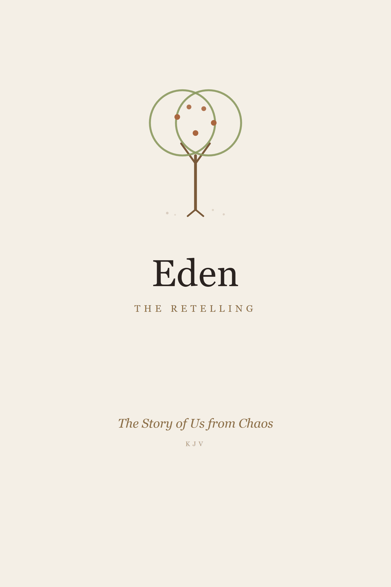

  

# Eden — The Retelling
### The Story of Us from Chaos&nbsp;&nbsp;·&nbsp;&nbsp;KJV

*The King James Bible retold as one story — the same stories you already know, handed back without the fear. Free to read.*

**Start here → [Introduction — Why You’re Here](00-introduction.md)**

---

### The Story
1. [Of the Deep, and the Light, and the Leaving](01-of-the-deep.md)
2. [The First Blood](02-the-first-blood.md)
3. [The Flood](03-the-flood.md)
4. [The Tower](04-the-tower.md)
5. [The Called](05-the-called.md)
6. [The Coat of Many Colors](06-the-coat-of-many-colors.md)
7. [The Burning Bush](07-the-burning-bush.md)
8. [The Mountain and the Long Wandering](08-the-mountain-and-the-long-wandering.md)
9. [The Kings](09-the-kings.md)
10. [The Prophets Ache](10-the-prophets-ache.md)
11. [The Coming](11-the-coming.md)
12. [The Teaching](12-the-teaching.md)
13. [The Choosing](13-the-choosing.md)
14. [The Rising](14-the-rising.md)
15. [The Sending](15-the-sending.md)
16. [The Homecoming](16-the-homecoming.md)

### Supplements
- [Enoch — The Walking and the Watching](17-enoch.md)
- [The Watchers — Their Story, Heard From Their Own Side](18-the-watchers.md)

---

*From* **The Story of Us** *· © E. Clark & Crew. Free to read and to share.*
